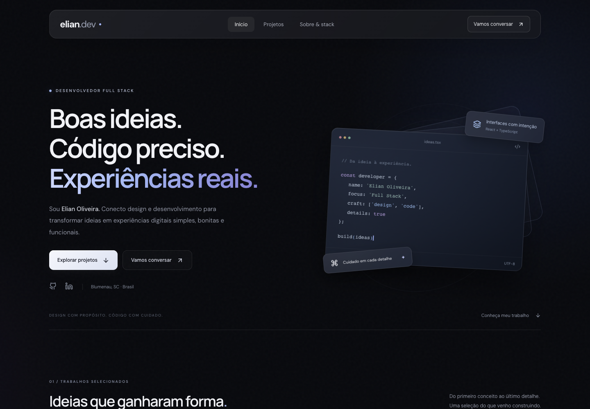
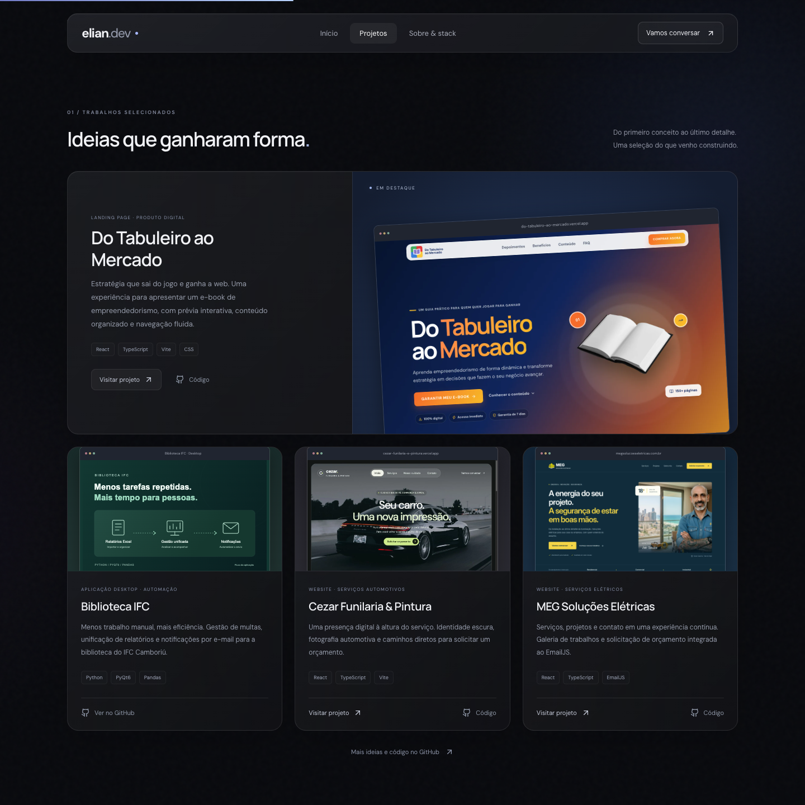
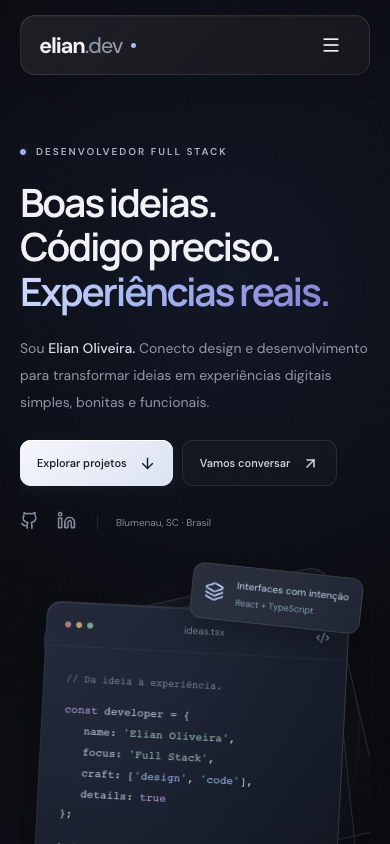
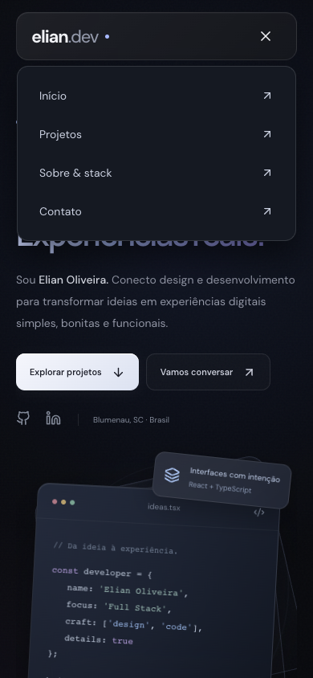

<div align="center">

# Elian Oliveira

### Desenvolvimento Full Stack · Design de interfaces

Boas ideias. Código preciso. Experiências reais.

[Visitar portfólio](https://elian.dev.br/) · [Explorar projetos](#projetos-em-destaque) · [Entrar em contato](mailto:elian.dev@proton.me)

**React 19 · TypeScript · Vite · Motion · pnpm**

</div>



## Sobre

Meu portfólio reúne projetos web e aplicações que desenvolvi para transformar necessidades reais em soluções digitais. A página apresenta meu trabalho, formação em Sistemas de Informação pelo IFC Camboriú, competências técnicas e canais de contato.

A identidade visual combina **glassmorphism escuro**, superfícies de vidro fosco, iluminação azul suave e ruído sutil. O motion design acompanha a navegação com entradas graduais, camadas flutuantes e microinterações, respeitando a preferência por movimento reduzido.

A implementação mantém uma estrutura simples: React e TypeScript para a interface, Vite para desenvolvimento e build, e CSS próprio para o sistema visual.

## Prévia da experiência

Capturas reais da aplicação executada localmente, registradas em **1º de outubro de 2026**. Clique nas imagens para visualizar em tamanho original.

### Projetos em desktop

[](docs/screenshots/desktop-projetos.png)

### Versão mobile

<p align="center">
  <a href="docs/screenshots/mobile-inicio.png"></a>
  &nbsp;&nbsp;
  <a href="docs/screenshots/mobile-menu.png"></a>
</p>

## Projetos em destaque

| Projeto | Proposta | Tecnologias |
| --- | --- | --- |
| [Do Tabuleiro ao Mercado](https://github.com/elianoliver/do_tabuleiro_ao_mercado) | Landing page para um e-book de empreendedorismo, com prévia interativa e conteúdo organizado. | React, TypeScript, Vite, CSS |
| [Biblioteca IFC](https://github.com/elianoliver/Sistema-de-Cobranca-da-Biblioteca-IFC) | Aplicação desktop para gestão de multas, unificação de relatórios e notificações por e-mail. | Python, PyQt6, Pandas |
| [Cezar Funilaria & Pintura](https://github.com/elianoliver/Cezar_Funilaria_e_Pintura) | Website de serviços automotivos com apresentação visual e contato para orçamentos. | React, TypeScript, Vite |
| [MEG Soluções Elétricas](https://github.com/elianoliver/Meg-Solucoes-Eletricas) | Website com catálogo de serviços, galeria de trabalhos e solicitação de orçamento. | React, TypeScript, EmailJS |

## Recursos

- **Navegação:** menu flutuante, indicação da seção ativa, âncoras e menu mobile com fechamento por Escape.
- **Motion design:** revelação de conteúdo durante a rolagem, composição de vidro animada e transições nos cartões.
- **Acessibilidade:** link para pular ao conteúdo, foco visível, controles identificados e suporte a `prefers-reduced-motion`.
- **Contato:** acesso direto a e-mail, WhatsApp, GitHub e LinkedIn; cópia do endereço de e-mail com feedback de sucesso ou falha.
- **Imagens:** capturas locais dos projetos em WebP, ilustração vetorial e carregamento adiado na galeria.
- **Responsividade:** layout verificado em larguras de 320 a 1920 px, sem rolagem horizontal nos cenários testados.

## Stack

| Tecnologia | Papel no projeto |
| --- | --- |
| React 19 + TypeScript | Componentes, estados e tipagem |
| Vite 7 + SWC | Desenvolvimento local e build de produção |
| CSS | Layout, vidro fosco, textura e responsividade |
| Motion | Animações de entrada e progresso de rolagem |
| Lucide React | Ícones vetoriais |
| pnpm | Gerenciamento de dependências e lockfile |
| ESLint | Análise estática do código |

Sem backend, roteador ou biblioteca de componentes. As fontes **DM Sans** e **Manrope** são carregadas pelo Google Fonts, com alternativas do sistema.

## Executar localmente

**Pré-requisitos:** Git, Node.js 24+ e pnpm 12.4.2, versão definida no campo `packageManager` de `package.json`.

```sh
git clone https://github.com/elianoliver/Portfolio.git
cd Portfolio
pnpm install --frozen-lockfile
pnpm dev
```

Abra o endereço informado pelo Vite, normalmente `http://localhost:5173`. Não são necessárias variáveis de ambiente.

### Comandos

| Comando | Descrição |
| --- | --- |
| `pnpm dev` | Inicia o servidor de desenvolvimento |
| `pnpm lint` | Analisa o código com ESLint |
| `pnpm typecheck` | Verifica os tipos TypeScript |
| `pnpm build` | Verifica os tipos e gera a versão de produção em `dist/` |
| `pnpm preview` | Serve o build localmente para conferência |

## Estrutura e personalização

```text
Portfolio/
├── .github/workflows/deploy.yml  # Build e publicação na Hostinger
├── docs/screenshots/            # Capturas deste README
├── public/projects/             # Imagens exibidas na galeria
├── src/
│   ├── components/              # Seções, navegação e animações
│   ├── data/projects.ts         # Projetos, tecnologias, imagens e links
│   ├── App.tsx                  # Composição da página
│   ├── index.css                # Sistema visual e responsividade
│   └── main.tsx                 # Entrada da aplicação
├── index.html                   # Título e metadados
├── package.json                 # Dependências e comandos
├── pnpm-lock.yaml               # Versões fixadas
├── pnpm-workspace.yaml          # Scripts de instalação permitidos
└── vite.config.ts               # Configuração do Vite
```

| O que alterar | Onde editar |
| --- | --- |
| Ordem, descrição, links e tecnologias dos projetos | `src/data/projects.ts` |
| Apresentação e redes sociais | `src/components/Hero.tsx` |
| Formação e competências | `src/components/Skills.tsx` |
| E-mail, WhatsApp e redes sociais | `src/components/Contact.tsx` |
| Cores, espaçamento, vidro e animações | `src/index.css` |
| Metadados de busca e compartilhamento | `index.html` |

### Origem das imagens

As capturas de [Do Tabuleiro ao Mercado](https://github.com/elianoliver/do_tabuleiro_ao_mercado/blob/main/docs/screenshots/desktop-inicio.png), [Cezar](https://github.com/elianoliver/Cezar_Funilaria_e_Pintura/blob/main/docs/screenshots/desktop-inicio.jpg) e [MEG](https://github.com/elianoliver/Meg-Solucoes-Eletricas/blob/main/docs/images/landing-desktop.png) foram obtidas nos respectivos repositórios e otimizadas em WebP. `biblioteca.svg` é uma ilustração do fluxo da aplicação, não uma captura de tela.

Ao atualizar o design, renove os arquivos em `docs/screenshots/` para manter esta documentação alinhada à interface.

## Validação e publicação

Antes de publicar:

```sh
pnpm lint
pnpm build
pnpm preview
```

A interface foi verificada em 320, 390, 768, 1024, 1440 e 1920 px. As verificações no navegador incluíram carregamento das imagens, navegação por âncoras, menu mobile, Escape, cópia de e-mail nos estados de sucesso e falha e preferência por movimento reduzido.

O workflow [`deploy.yml`](.github/workflows/deploy.yml) é acionado por um push em `main`: instala as dependências com pnpm, gera `dist/` e envia os arquivos para a Hostinger via FTP. As credenciais são obtidas dos secrets `FTP_SERVER`, `FTP_USERNAME` e `FTP_PASSWORD`.

A configuração existente usa `dangerous-clean-slate: true`, que limpa o diretório remoto de destino antes do envio. Esse diretório deve ser exclusivo do portfólio.

Acompanhe as execuções em [GitHub Actions](https://github.com/elianoliver/Portfolio/actions).

## Contato

**Elian Oliveira** · Blumenau, Santa Catarina

[Portfólio](https://elian.dev.br/) · [E-mail](mailto:elian.dev@proton.me) · [LinkedIn](https://www.linkedin.com/in/elian-oliveira/) · [GitHub](https://github.com/elianoliver)
